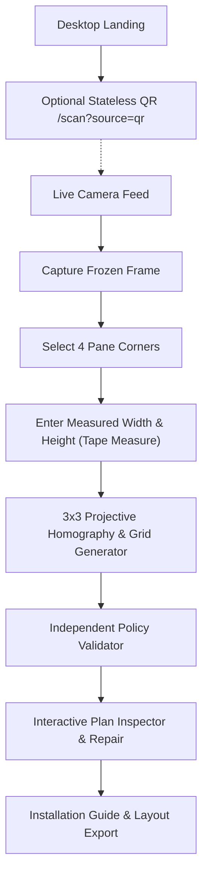

# WingGap

> WingGap is a planning tool, not a collision-risk predictor or installed-treatment certification system.

WingGap is a lightweight, mobile-first field planning instrument for bird-friendly window treatments. It helps you take a real window pane, measure its physical dimensions, and generate a regular, inspectable exterior dot grid that satisfies published bird-safe window spacing standards.

---

## Problem
Clear and reflective architectural glass causes hundreds of millions of bird collisions each year. Birds do not perceive glass as a solid barrier; they see reflections of open vegetation and sky, or transparent pathways to spaces beyond.

Published standards (such as American Bird Conservancy guidelines and CSA A460:19) recommend that clear gaps between pattern markers not exceed 50.8 mm (2 inches) on the exterior glass surface. In practice, calculating a clean, symmetrical layout for custom window dimensions without leaving large untreated openings is difficult. Installers often estimate hand spacing or stretch pre-cut patterns, inadvertently creating gaps where birds can strike.

## What WingGap Does
WingGap converts real window panes into verified, pane-specific exterior dot grids:
- **Freezes a single stable frame** from your phone's camera.
- **Maps the perspective quadrilateral** of the glass daylight opening.
- **Accepts measured dimensions** directly from a tape measure.
- **Computes a canonical grid** with a target center pitch $\le 45\text{ mm}$, guaranteeing built-in headroom below the 50.8 mm clear-spacing threshold when standard 6.35 mm (1/4 in) dots are used.
- **Audits omitted markers**: Lets you inspect individual dots, remove markers around obstructions, and immediately see the recalculated clear opening.
- **Repairs layouts**: Restores canonical geometry in one tap.
- **Provides an installation guide**: Displays exact edge-offset measurements for chalk lines and allows exporting a schematic stamped `NOT TO SCALE`.

## Architecture & How It Works



1. **Camera Framing & Freeze**: The phone camera streams a live feed. Tapping `Capture pane` draws the frame onto an offscreen canvas and freezes it. All camera tracks immediately shut down to conserve battery and protect privacy.
2. **Perspective Homography**: You drag four corner pins to match the rectangular pane frame. WingGap computes the 3×3 projective homography matrix mapping the physical pane rectangle $[0, W] \times [0, H]$ directly into image space.
3. **Physical Measurements**: WingGap never estimates scale from pixels. You enter the actual measured width and height.
4. **Independent Validation**: The validator recalculates all grid properties from scratch using locked constants ($d = 6.35\text{ mm}$, target pitch $\le 45\text{ mm}$, clear gap $\le 50.8\text{ mm}$).
5. **Interactive Deletion & Repair**: Tapping a dot in the perspective overlay allows removing it. WingGap calculates the new clear glass opening and warns if it exceeds 50.8 mm. Tapping `Repair layout` restores canonical spacing.

## Why the Geometry is Inspectable
Most bird-friendly visual patterns are treated as black-box decorative stickers. If an installer skips a dot to avoid a lock mechanism, window handle, or pane flaw, the effect on clear spacing is usually ignored.

In WingGap:
- Every dot coordinate is inspectable.
- Edge deletions measure the clear glass from surviving dots to the frame boundary (`Affected boundary clearance`).
- Interior deletions measure the span between adjacent surviving dots (`Affected center span` and clear glass opening).
- The independent validator immediately flags when a missing marker causes the clear gap to exceed 50.8 mm.

## Physical Planning Convention
WingGap applies a locked physical convention based on peer-reviewed collision research:
- **Exterior Application (Surface 1)**: Markers must be applied to the outside surface of the glass. Interior markers are largely neutralized by surface specular reflections.
- **Dot Diameter**: $6.35\text{ mm}$ ($1/4\text{ inch}$).
- **Target Center Pitch**: $\le 45.0\text{ mm}$ horizontally and vertically.
- **Guidance Clear Gap**: Clear glass between dot edges must not exceed $50.8\text{ mm}$ ($2\text{ inches}$).
- **Headroom**: With 45 mm pitch and 6.35 mm dots, canonical clear opening is $38.65\text{ mm}$, leaving $12.15\text{ mm}$ of engineering headroom below the 50.8 mm ceiling.

## Technology
- **Next.js 14** (App Router, static production export)
- **TypeScript** with strict type-checking
- **Tailwind CSS** for responsive layout and high-contrast UI
- **Vitest** with 75 automated unit, adversarial, homography, and property tests
- **QRCode** for optional desktop-to-mobile handoff
- No OpenCV, Python sidecars, or external ML black-box dependencies.

## Run Locally

```bash
# Clone repository
git clone https://github.com/Syedsaadhhh/WingGap-.git
cd WingGap-

# Install dependencies
npm install

# Start development server
npm run dev
```

Open [http://localhost:3000](http://localhost:3000) in your browser.

## Verify

```bash
# Run full verification suite (lint, typecheck, tests, production build)
npm run verify
```

Individual commands:
```bash
npm run lint       # Run Next.js ESLint
npm run typecheck  # Run TypeScript compiler check (tsc --noEmit)
npm run test       # Run Vitest test suite (75 tests)
npm run build      # Build static production bundle
```

## Privacy
- **Zero Server Storage**: WingGap runs 100% client-side in your browser.
- **No Image Uploads**: Camera frames remain strictly in volatile memory while you plan.
- **No Frame Persistence**: Raw captured photos are never written to `sessionStorage` or `localStorage`.
- **No Telemetry**: No trackers, cookies, external analytics, or third-party ads.

## Limitations
- **Planning tool only**: WingGap does not observe or certify physical placement after installation.
- **Requires tape measure**: Cannot automatically infer physical window dimensions from camera pixels alone.
- **Single planar pane**: Designed for single planar rectangular glass panes; curved or irregular non-quadrilateral panes are not supported.
- **Surface 1 required**: If applied to Surface 2 (interior), solar reflections will compromise visibility.

## Scientific Sources
- **American Bird Conservancy (ABC)**: *Bird-Friendly Building Standard* (exterior 2-inch rule for visual markers).
- **Canadian Standards Association (CSA)**: *CSA A460:19 Bird-Friendly Building Design Standard*.
- **Klem, D. (1990, 2009)**: Field and experimental evaluations of window collisions and visual marker spacing.
- **Rössler, M. et al. (2015)**: Flight tunnel tests on glass marker efficacy and exterior vs. interior application.

## Demo
A step-by-step video demonstration script is available in [docs/demo/final-demo.md](docs/demo/final-demo.md).
